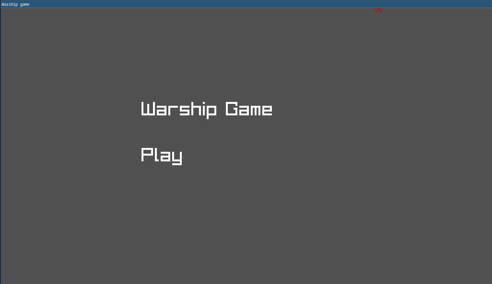
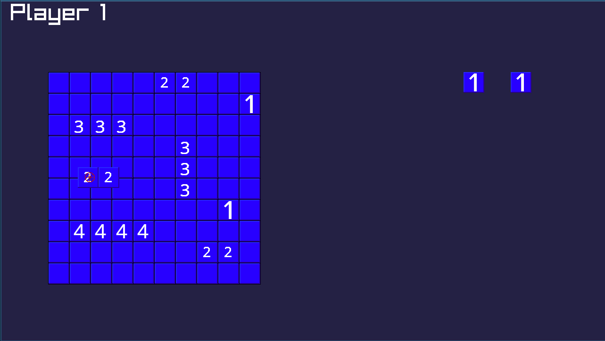
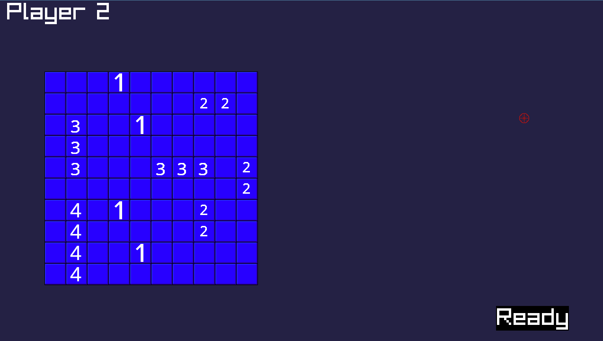
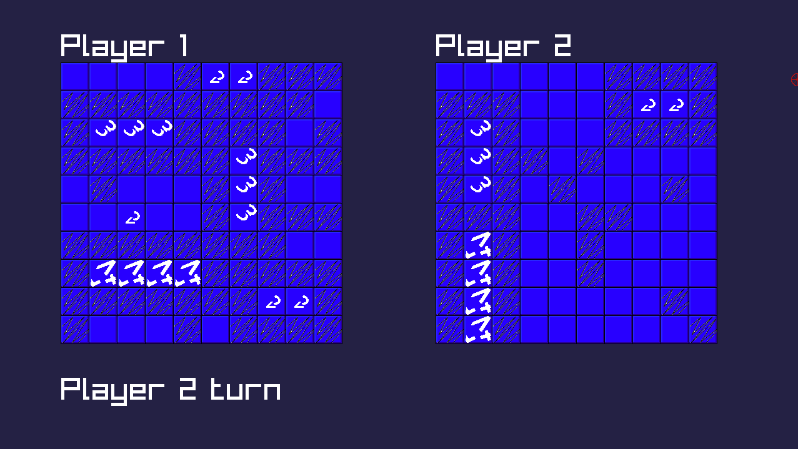

# Warship Game

A game that I wanted to implement.

# How to build

 
### Windows
```Install Visual Studio and open Visual Studio in project folder ```

### Linux 
```bash 
mkdir build
cd build
cmake ..
make
```

# Some screenshots





